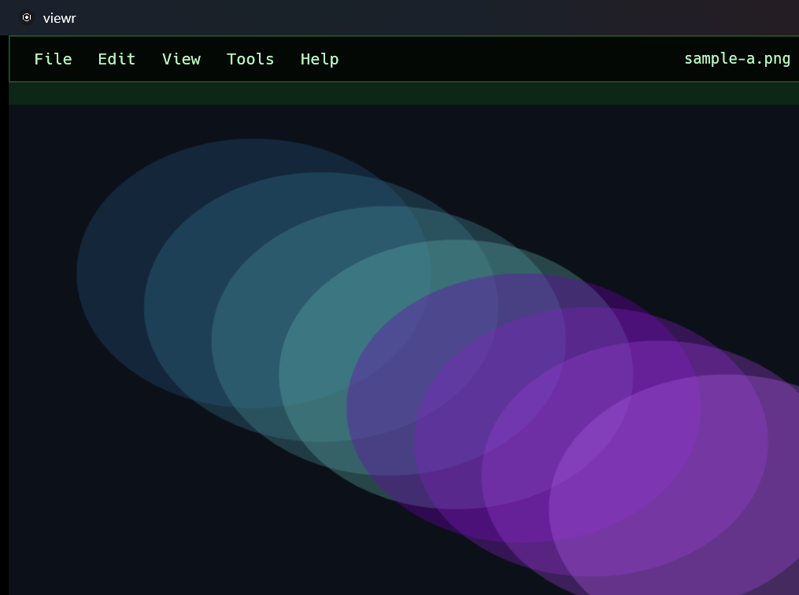

# viewr

**A private photo viewer that just shows your photos.**

[](https://github.com/blisspixel/viewr/actions/workflows/ci.yml)

viewr is a fast, local desktop image viewer for Windows, macOS, and Linux. It has
no account, cloud service, telemetry, advertising, background indexer, or automatic
update check. Open a file or folder, inspect it, rate it, make a small edit, save a
copy, or move it to the operating system Trash.

viewr is pre-1.0. The source repository and hosted quality gates are public, but no
tagged GitHub Release has been published yet. Build from source today. The prepared
one-command installers become active with the first release. Windows code signing,
macOS notarization, final human screen-reader evidence, target-hardware acceptance,
and per-display color correctness remain before a broadly recommended 1.0.

## Interface



Console appearance shown with an example image, current dimensions and zoom,
rating state, and folder position. The capture contains only the application
window, with no private path or unrelated desktop content.

## Install

### Build from source today

Install the prerequisites in [Installing viewr](docs/INSTALL.md), then run:

```text
cargo build --release --workspace --locked
```

Keep `viewr` and `viewr-decode` from the same build side by side. The application
itself performs no network activity.

### One-command installation after the first release

No public binary exists yet. After the first tagged release, these commands will
download its archive from the official repository, verify the SHA-256 sidecar and
internal manifest, and install it for the current user without elevation. They do
not add an updater service.

#### Windows 10 or 11, x64

```powershell
irm https://raw.githubusercontent.com/blisspixel/viewr/main/install.ps1 | iex
```

The app is installed under `%LOCALAPPDATA%\Programs\viewr`, added to the user PATH,
and placed in the Start menu.

#### macOS or Linux

```sh
curl -fsSL https://raw.githubusercontent.com/blisspixel/viewr/main/install.sh | sh
```

The command is installed under `~/.local`. macOS supports Intel and Apple Silicon.
The planned first Linux release target is x86-64 glibc.

Run the same command again to update explicitly. To inspect a script before running
it, download it without piping it to a shell. Manual archive installation, version
pinning, uninstall steps, platform limits, source builds, and release verification
are documented in [Installing viewr](docs/INSTALL.md).

## What viewr does

- Opens a broad pure-Rust core format set, including JPEG, PNG, GIF, WebP, TIFF,
  SVG, JPEG XL, OpenEXR, and common bitmap formats.
- Starts decoding while the window initializes and navigates sibling images without
  blanking the last good frame.
- Provides GPU pan, zoom, fit, animation, rotation, crop, bounded Spot Heal, Save As,
  and format conversion.
- Strips supported metadata from saved copies by default, with an explicit
  session-only option to retain supported EXIF fields.
- Shows a presence-only Source Privacy summary for sensitive EXIF categories.
- Assigns embedded 0-to-5 XMP ratings and filters a folder by minimum rating without
  creating a catalog, sidecar, or activity history.
- Moves only the visible image to system Trash with exact-receipt Undo when the
  platform can prove it. Permanent delete is separate and confirmed.
- Offers native dialogs, keyboard-first controls, AccessKit semantics, four chrome
  themes, and independent image-inspection backgrounds.

The exact format table and current limits are in [Formats](docs/FORMATS.md). Product
scope and remaining work are tracked in [Roadmap](docs/ROADMAP.md).

## Privacy and security

The application dependency graph contains no HTTP or TLS client. viewr sends no
photos, filenames, paths, metadata, diagnostics, ratings, or usage data anywhere.
Normal runs create no logs. Optional C-backed image formats execute in a bounded
helper that receives encoded bytes rather than a filesystem path, and platform
packages add network-denied sandbox profiles.

Opening an image still means parsing untrusted data. The codebase uses bounded
decoding, dimension and allocation limits, source-identity checks around destructive
operations, fail-closed metadata writes, dependency policy, fuzzing, and native
platform tests. See [Privacy](docs/PRIVACY.md), [Architecture](docs/ARCHITECTURE.md),
and [Security Policy](SECURITY.md) for the precise boundaries.

The installer scripts are separate foreground tools. They contact only the official
GitHub repository after the user runs them and verify the selected release before
installation. viewr itself never checks for updates automatically.

## Essential controls

| Action | Control |
| --- | --- |
| Open file or folder | `Ctrl/Cmd+O`, `Ctrl/Cmd+Shift+O` |
| Previous or next image | Left/Right, `A`/`D` |
| Fit or actual size | Primary modifier + `0`/`1` |
| Zoom | `+`, `-`, wheel or trackpad |
| Pan | Drag, or hold Space and drag |
| Tools, folder previews, image information | `T`, `G`, `I` |
| Rate or clear rating | `1` through `5`, `0` |
| Crop or Spot Heal | `C`, `J` |
| Reload after an external edit | `F5` |
| Move current image to Trash | Delete |
| Undo the latest recoverable Trash action | `U` |

Menus expose the same actions and their shortcuts. There is no flag, review queue,
batch-trash mode, or bare-letter delete shortcut. Detailed interaction and
accessibility behavior is in [Design](docs/DESIGN.md) and
[Accessibility](docs/ACCESSIBILITY.md).

## Appearance

- **System** follows the operating system's light or dark setting.
- **Light** uses bright neutral chrome.
- **Dark** uses low-glare charcoal chrome.
- **Console** uses near-black chrome, phosphor-green text, and monospace type.

Image Background independently offers Theme Default, Black, Neutral Gray, and
White. Appearance changes interface chrome and canvas only, never image pixels.

## Development

The repository pins its Rust toolchain and dependency lockfiles. The normal local
gate is:

```text
cargo fmt --all -- --check
cargo clippy --workspace --all-targets --locked -- -D warnings
cargo test --workspace --all-targets --locked
```

CI also enforces at least 85 percent meaningful logic coverage, Python release-tool
tests, dependency license and advisory policy, privacy tripwires, fuzz targets,
platform sandbox profiles, native accessibility, deterministic release archives,
and GUI performance budgets. See [Contributing](CONTRIBUTING.md) and
[Verification](docs/VERIFY.md) before submitting a change.

## Documentation

The [documentation index](docs/README.md) links installation, privacy, formats,
ratings, accessibility, architecture, design, standards, verification, performance,
publishing, and roadmap documents. [CHANGELOG.md](CHANGELOG.md) records user-visible
changes.

## License

viewr is licensed under the [Apache License 2.0](LICENSE), including its express
patent grant and standard warranty disclaimer. [NOTICE](NOTICE) identifies the
project distribution. Third-party components retain their own licenses, collected
in [THIRD_PARTY_LICENSES.html](THIRD_PARTY_LICENSES.html).
