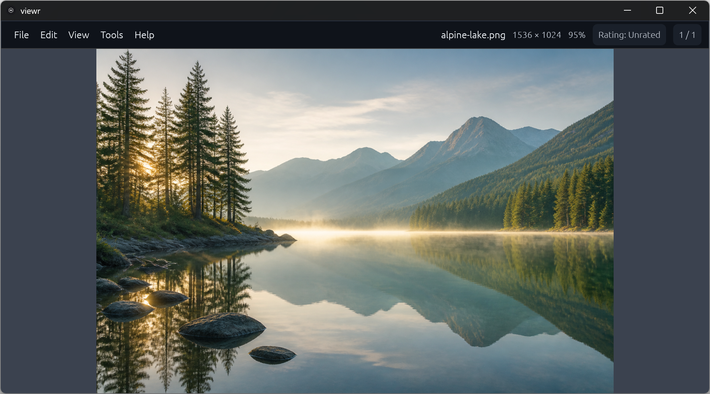
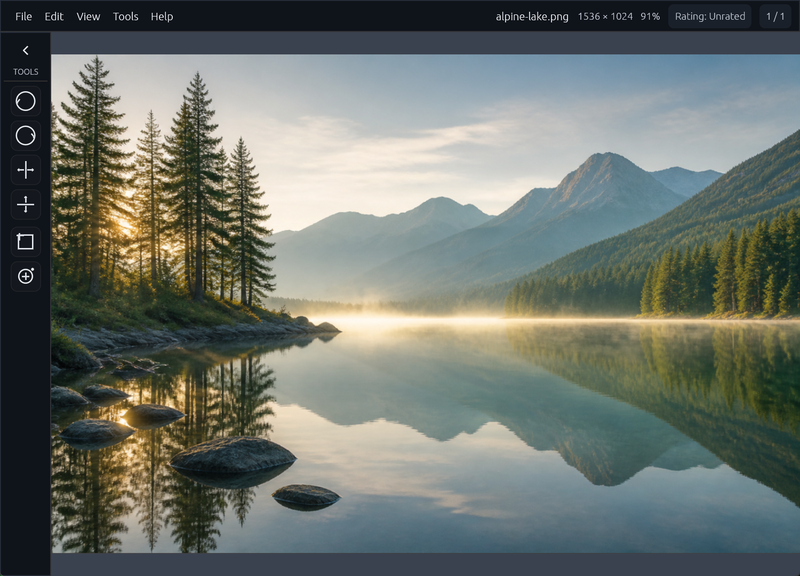

# viewr

**Fast photos. No account. No tracking. No subscription.**

[](https://github.com/blisspixel/viewr/actions/workflows/ci.yml)

Tired of photo software that wants to become a cloud library, storefront, and
subscription? viewr rejects the spyware-and-bloatware pattern of turning a simple
utility into a data-collection platform. It keeps the photo at the center. Open a
file or folder, move through photos quickly, see a full-image collage of the
current group, inspect metadata, use ratings to narrow the keepers, crop or
rotate, repair a small blemish with Spot Heal, save a JPEG, PNG, WebP, or BMP
copy, and get back to what you were doing.

viewr is a focused desktop image viewer for Windows, macOS, and Linux. Focused
does not mean bare. Its small editing tools are deliberate parts of the viewing
workflow, without the catalog, project, cloud, and subscription machinery of a
full editing suite. **No tracking is literal.** The application has no account,
cloud service, telemetry, analytics, advertising, background indexer, activity
history, crash-report uploader, or automatic update check.

## Why viewr

- **Fast by design.** Decoding begins while the window initializes, neighboring
  images are prefetched within fixed memory limits, extra cores fill those slots,
  and performance budgets run in CI.
- **Private by construction.** The application dependency graph contains no HTTP
  or TLS client. Photos, paths, metadata, ratings, and diagnostics stay local.
- **Focused, not bare.** Folder navigation, ratings, rotation, crop, bounded Spot
  Heal, Save As, and conversion are intentional core viewer tools. Deeper work
  stays with an editor you choose through native Open With, without adding a
  catalog or subscription.
- **Cross-platform.** The same Rust codebase is built and tested on Windows,
  macOS, and Linux, with native dialogs, menus, shortcuts, and accessibility
  semantics.

## Interface

### Dark



### Dark with Tools



Both captures show the same repository-safe demonstration image. Each PNG is a
programmatic application-only capture, with no private path or unrelated desktop
content. Appearance and panel behavior are detailed in the
[interface design guide](docs/DESIGN.md).

## Install

v0.6.0 is the current public preview. Its portable archives are checksummed and
attested, but they are not Authenticode-signed on Windows or notarized on macOS.
Normal operating-system trust warnings may appear. Do not disable platform
security controls to force a launch. The representative-hardware product-quality
matrix was not completed for this tag; the
[v0.6.0 notes](docs/releases/v0.6.0.md) record that gap exactly.

### Windows 10 or 11, x64

```powershell
irm https://github.com/blisspixel/viewr/releases/download/v0.6.0/install.ps1 | iex
```

viewr installs for the current user under `%LOCALAPPDATA%\Programs\viewr`, adds
that directory to the user PATH, and creates a Start menu shortcut. No elevation
or updater service is required.

### macOS or Linux

```sh
curl -fsSL https://github.com/blisspixel/viewr/releases/download/v0.6.0/install.sh | sh
```

viewr installs under `~/.local`. The preview supports Intel and Apple Silicon
macOS plus x86-64 glibc Linux.

The published command downloads the v0.6.0 installer, which installs the v0.6.0
archive after verifying its SHA-256 sidecar and internal manifest, without
giving the application network access.
Run the same command again for an explicit update. For review-first installation,
manual archive verification, uninstall steps, platform prerequisites, or a source
build, see [Installing viewr](docs/INSTALL.md).

## What it does

- Opens JPEG, PNG, GIF, WebP, TIFF, SVG, JPEG XL, OpenEXR, and common bitmap
  formats, including bounded animation and multi-page image navigation.
- Browses folders Latest First by default or in saved natural filename order,
  while keeping the selected image and last good frame stable.
- Provides GPU pan, zoom, fit, rotation, crop, bounded Spot Heal, Save As, and
  conversion. Edits stay in memory until Save As writes a copy; the original is
  left untouched.
- Stores standard 0-to-5 XMP ratings in supported JPEG files and filters the
  current folder without creating a catalog or sidecar.
- Shows up to 12 complete photos in a dense, aspect-aware full-image collage.
- Shows a presence-only Source Privacy summary and strips supported metadata from
  saved copies by default.
- Uses native Open With, system Trash with receipt-bound Undo, and explicit
  confirmation for permanent deletion.
- Keeps file associations opt in. File > Default Image Viewer explains how to
  choose viewr per format on Windows, macOS, and Linux.
- Offers native dialogs, keyboard-first controls, AccessKit semantics, four chrome
  appearances, and independent image-inspection backgrounds.

See [Design](docs/DESIGN.md) for interaction details,
[Formats](docs/FORMATS.md) for the exact format table,
[Ratings](docs/RATINGS.md) for the write-safety contract, and
[Roadmap](docs/ROADMAP.md) for implemented behavior and remaining work.

## Privacy and security

viewr sends no photos, filenames, paths, metadata, diagnostics, ratings, or usage
data anywhere. Normal runs initialize no logger and create no logs. Explicit
developer-only console diagnostics are opt-in, path-private, local, and never
written to a log file. Optional C-backed image formats execute in a bounded helper
that receives encoded bytes rather than a filesystem path, and platform packages
add network-denied sandbox profiles.

Opening an image still means parsing untrusted data. The codebase uses bounded
decoding, allocation limits, source-identity checks around destructive operations,
fail-closed metadata writes, dependency policy, fuzzing, and native platform
tests. The precise boundaries are in [Privacy](docs/PRIVACY.md),
[Architecture](docs/ARCHITECTURE.md), and the [Security Policy](SECURITY.md).

Installer scripts are separate foreground tools. They contact only the official
GitHub repository after the user runs them. viewr itself never checks for updates
automatically.

## Essential controls

| Action | Control |
| --- | --- |
| Open file | `O`, `Ctrl/Cmd+O`, or drop a file |
| Open folder | `Ctrl/Cmd+Shift+O`, or drop a folder |
| Previous or next image | Left/Right, Home/End, Page Up/Page Down |
| Folder order | File > Preferences or View > Folder Sort; Latest First is the initial default |
| Previous or next page or frame | `[` / `]` |
| Fit, pan, or actual size | Space tap fits; hold Space to pan; `Ctrl/Cmd+0` / `Ctrl/Cmd+1` |
| Fullscreen | `F` or `F11`; Escape leaves after crop and Spot Heal |
| Full-image collage | Up or `Shift+G` enters; Left/Right selects; Down, Enter, or click opens; Page Up/Page Down changes groups; Escape returns |
| Zoom | `+`, `-`, wheel or trackpad |
| Tools, folder previews, image information | `T`, `G`, `I` |
| Rate or clear rating | `1` through `5`, `0` |
| Crop or Spot Heal | `C`, `J` |
| Reload after an external edit | `F5` |
| Save As | `Ctrl/Cmd+Shift+S` |
| Move current image to Trash | Delete |
| Undo the latest recoverable Trash action | `U` |

Menus expose the same actions and shortcuts. There is no flag, review queue,
batch-trash mode, or bare-letter delete shortcut. Detailed interaction behavior is
in [Design](docs/DESIGN.md) and [Accessibility](docs/ACCESSIBILITY.md).

Ratings write 0-to-5 into ordinary JPEG files as standard XMP. Scope, states,
and the write-safety contract are in [Ratings](docs/RATINGS.md).

## Appearance

- **System** follows the operating system's light or dark setting.
- **Light** uses bright neutral chrome.
- **Dark** uses low-glare charcoal chrome.
- **Console** uses near-black chrome, phosphor-green text, and monospace type.

Image Background independently offers Theme Default, Black, Neutral Gray, and
White. Appearance changes interface chrome and canvas only, never image pixels.

## Project status

v0.6.0 is the current public preview and install target, not a percentage-complete
score or a claim that the product is finished. It is the integrated
product-quality beta after the published v0.5.0 format-contract release.
The first preview v0.1.0, the v0.1.1 through v0.1.5 patches, v0.2.0, v0.3.0,
v0.4.0, and v0.5.0 remain published. `main` continues the logical order in the
[roadmap](docs/ROADMAP.md#order-of-operations-to-10): **v0.7.0** accessibility
evidence through v0.9 publisher authentication, then v1.0.
The [current release notes](docs/releases/v0.6.0.md) state the exact published
limits, including that the representative-hardware product-quality matrix was
not completed for this tag and that its rows remain open work.
Unpublished candidates are identified by exact commit and workflow run. The
[publishing guide](docs/PUBLISHING.md#version-state-policy) defines when the
workspace version, release documents, and public install links advance.

## Development

The repository pins its Rust toolchain and lockfiles. The normal local gate is:

```text
cargo fmt --all -- --check
cargo clippy --workspace --all-targets --locked -- -D warnings
cargo test --workspace --all-targets --locked
```

CI also enforces at least 85 percent meaningful logic coverage, Python
release-tool tests, dependency license and advisory policy, privacy tripwires,
fuzz targets, platform sandbox profiles, native accessibility, deterministic
release archives, and GUI performance budgets. Read
[Contributing](CONTRIBUTING.md) and [Verification](docs/VERIFY.md) before
submitting a change.

The [documentation index](docs/README.md) links every user, architecture,
quality, privacy, and release document. [CHANGELOG.md](CHANGELOG.md) records
user-visible changes.

## License

viewr is licensed under the [Apache License 2.0](LICENSE), including its express
patent grant and standard warranty disclaimer. [NOTICE](NOTICE) identifies the
project distribution. Third-party components retain their own licenses, collected
in [THIRD_PARTY_LICENSES.txt](THIRD_PARTY_LICENSES.txt).
